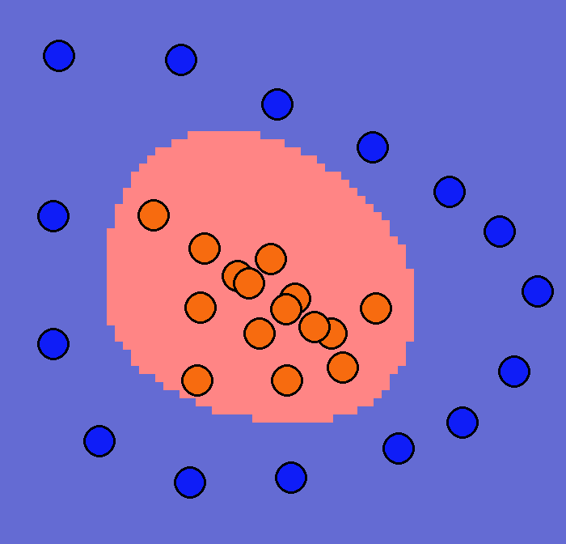

# Perceptron Visualization
Visualization of training and operation of a perceptron written from scratch in numpy



## How to run

1. Install dependencies (PyGame)
```
pip install -r requirements.txt
```
2. Run application
```
python ./main.py
```